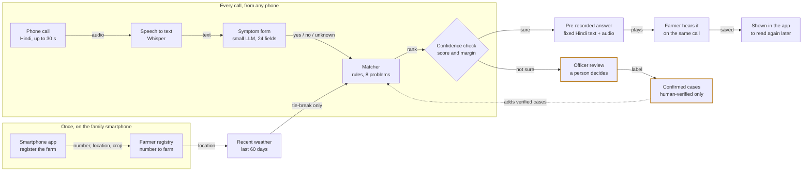

# Technical walkthrough

Team **Small Talk, Big Harvest** · Hack-Nation × World Bank "Small AI for Development", Challenge 04, Agriculture.

> Because of this tool, a smallholder coffee farmer will know within minutes of a phone call what is likely
> affecting her crop and what to do, which she would otherwise learn at the extension officer's next visit or
> never. We know because the officer reaches her village about twice a year.

The farmer needs only a basic phone and a voice call in Hindi. No app, no data bundle, no reading.
A designed version of this page is in [`walkthrough.html`](walkthrough.html).

## The workflow

The language model only fills a fixed form. Rules decide, and the farmer hears text a person wrote. The
highlighted path is the fail-safe: when the system is not sure, a person decides, and only that person's
label teaches the system.

## Step by step

| Step | What happens | Built with | Why this way |
|---|---|---|---|
| Register | A family member enters the phone number, farm location, crop and field size once. | Installable web app, works offline | A call can only be matched to a farm if a registry exists. Location is rounded to about 1 km. |
| Call | The farmer calls and, after the beep, describes what she sees. | Twilio voice line | Works on any phone and needs no literacy. |
| Listen | The recording becomes Hindi text. | Whisper (open weights) | If the recognition confidence is low, the case goes to the officer. |
| Understand | The text becomes 24 symptom fields, each yes, no or not mentioned. | Small open LLM, forced to a fixed schema | The model cannot write advice, so it cannot invent advice. |
| Decide | The symptoms are scored against 8 coffee problems. Recent weather can break a tie. | Plain rules and Open-Meteo weather | Every decision can be read and audited line by line. |
| Answer | The farmer hears a pre-recorded answer, or that the officer will call her. | Human-written text and audio | A fixed list of answers can be checked for safety. |
| Follow up | The answer appears in the app. Unsure cases wait in the officer's queue. | Review page for the officer | The officer's label is the only thing that updates the knowledge base. |

## Where the AI is, and where it is not

**AI does two jobs:** it turns spoken Hindi into text, and it turns free text into a fixed symptom form.
A keypad menu or SMS form cannot take "the leaves have orange powder underneath and are falling". Free
speech in a local language is the part only AI can do.

**AI does not** choose the diagnosis (rules do), write what the farmer hears (people did), or learn from its
own guesses (only officer labels count).

**The system says "not sure" when** fewer than 2 symptoms were understood, the best match scores below 0.75,
the top two problems are within 0.15, speech recognition confidence is below 0.45, or anything fails.

## How it fits Small AI

| Rule | How we meet it |
|---|---|
| A device she already has | Any phone that can make a call. The smartphone app is used once, by a family member. |
| Core feature works offline | The farmer needs no data connection, only a voice call. Both models can run on one laptop at the cooperative without cloud AI; the weather step is skipped when there is no internet and the answer flow stays the same. |
| Small model files | Open-weight models that fit on a laptop: Whisper large-v3-turbo and a 4-billion-parameter LLM (gemma3:4b). |
| A named local language | Hindi, by voice. Adding a language is configuration, translated answers and recordings, with no code change. |
| A person makes the final call | Every unsure case goes to the extension officer, and the advice itself tells the farmer to confirm with the officer before drastic steps. |

## Evidence so far

Twelve Hindi test descriptions, spoken as synthetic audio and run through the whole chain. A wrong answer
matters more than a missed one.

| Setup | Correct | Wrong | Not sure | Time per case |
|---|---|---|---|---|
| Hosted open models (Whisper large-v3, Qwen3.5-9B) | 83% | 0% | 17% | about 9 s |
| Fully local (Whisper large-v3-turbo, gemma3:4b) | 92% | 8% | 0% | about 23 s |

Hindi speech recognition on 25 FLEURS clips: word error rate 0.15 with the local model. The same model
reaches 0.35 on Swahili, which shows how a less-supported language would fare.

The one wrong local answer came from a misheard word that led the model to add a symptom. A Hindi keyword
cross-check, which already exists for Swahili, is the planned fix. Full results: [`eval/RESULTS.md`](../eval/RESULTS.md).

## Privacy

- Consent is given once, at registration in the app. The call itself has no consent question.
- The voice recording is used for that one answer and deleted after transcription.
- Phone numbers are stored as a salted hash, plus an encrypted copy for the officer's call back.
- Location is kept at about 1 km precision. Data is deleted after 12 months.
- "Delete my data" in the app removes everything. Callers who are not registered can press 9 on the call.

## What this does not cover yet

- Only 8 coffee problems. Anything else gets "not sure".
- The knowledge base and advice texts are drafts and have not been reviewed by an agronomist.
- The audio answers are synthetic placeholder voices, not native-speaker recordings.
- No recordings from real farmers yet. Tests use clean or synthetic speech; phone audio is harder.
- By default the prototype uses a hosted service for the two open models, because it is faster. The fully
  local setup works but takes about 23 seconds on a laptop with a small graphics card.
- A caller who has not registered in the app is recorded without being asked for consent first.
- Registration has no SMS code check, and the crop and field size are stored but not yet used in the diagnosis.
- The link between app registration and the call is covered by automated tests and has not yet been run on a live call.

Stack: FastAPI, SQLite, Twilio Voice, faster-whisper, Ollama, Open-Meteo, React (installable web app).
Speech test data: FLEURS (CC-BY-4.0). Test sentences and knowledge base: written by the team.
